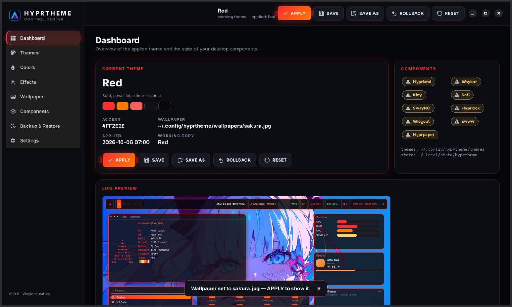
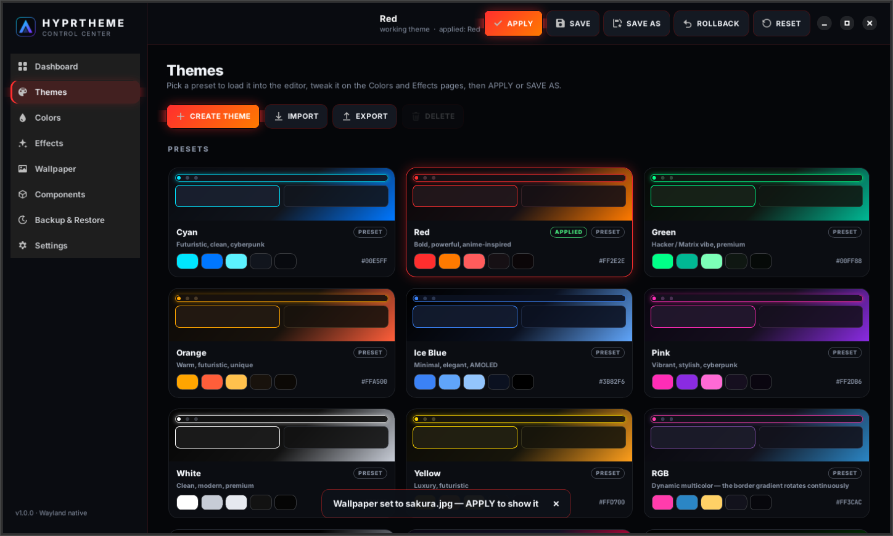
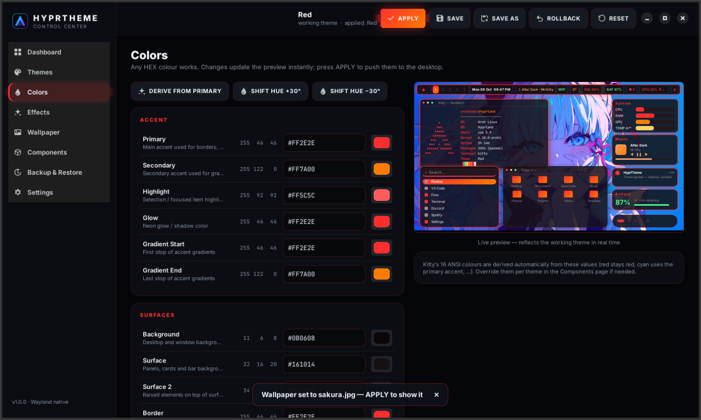
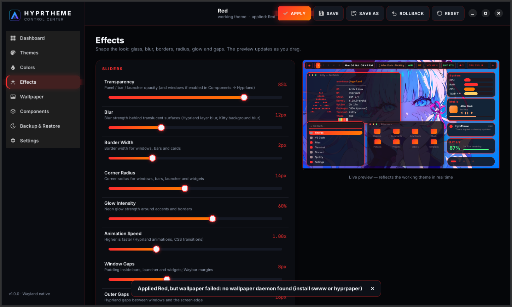
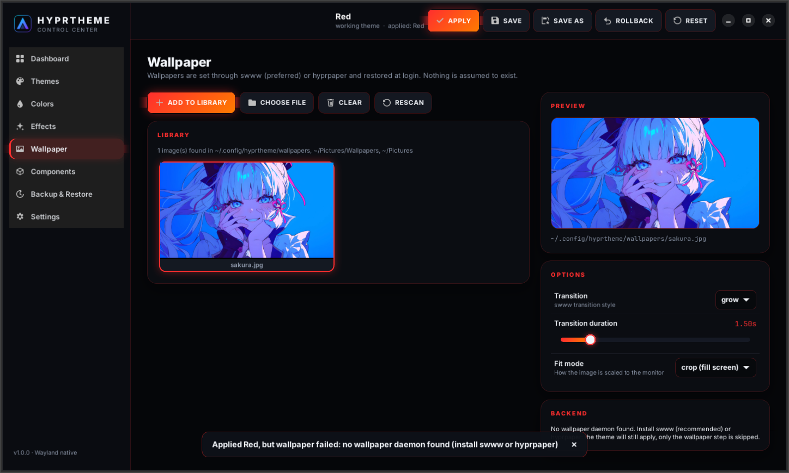
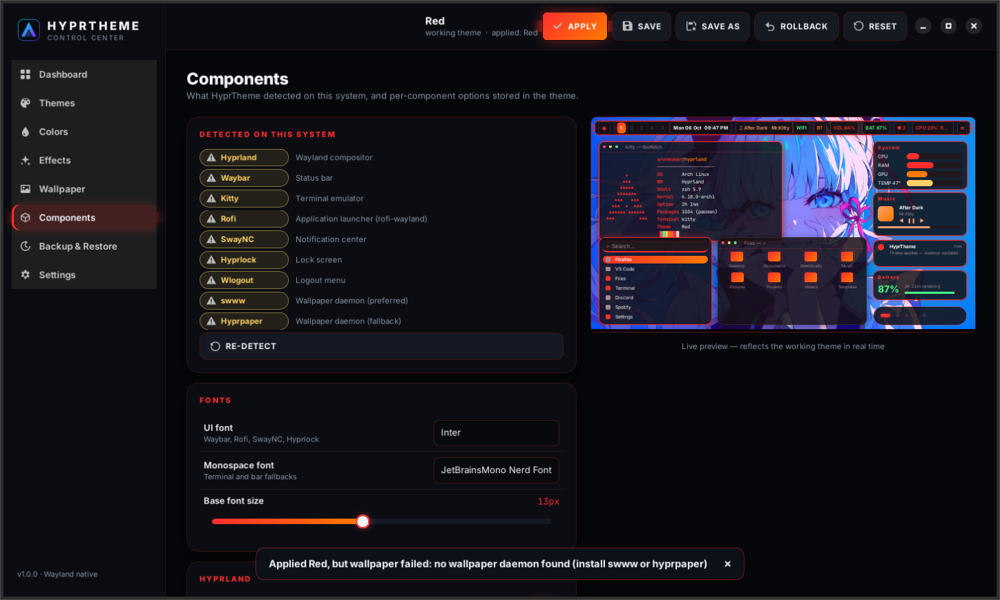
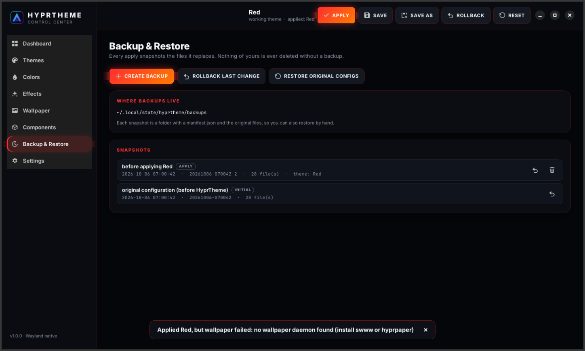
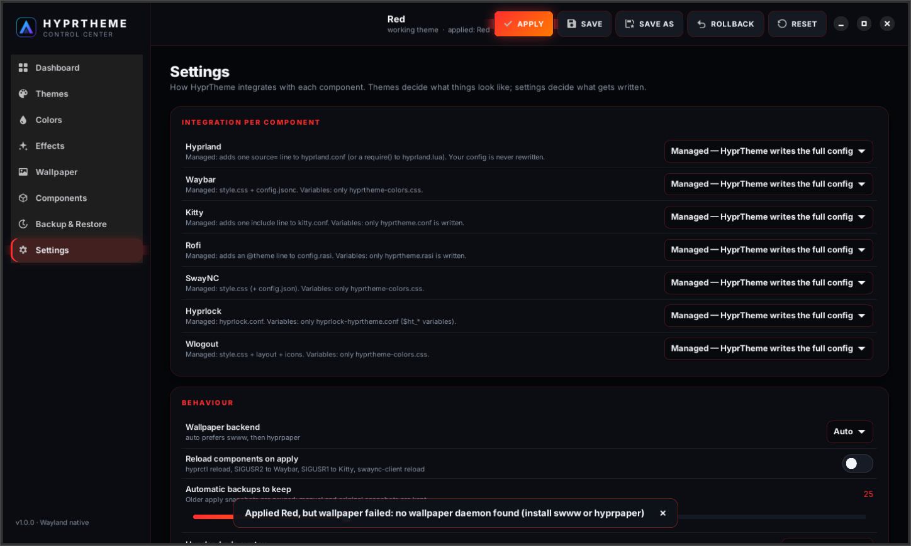
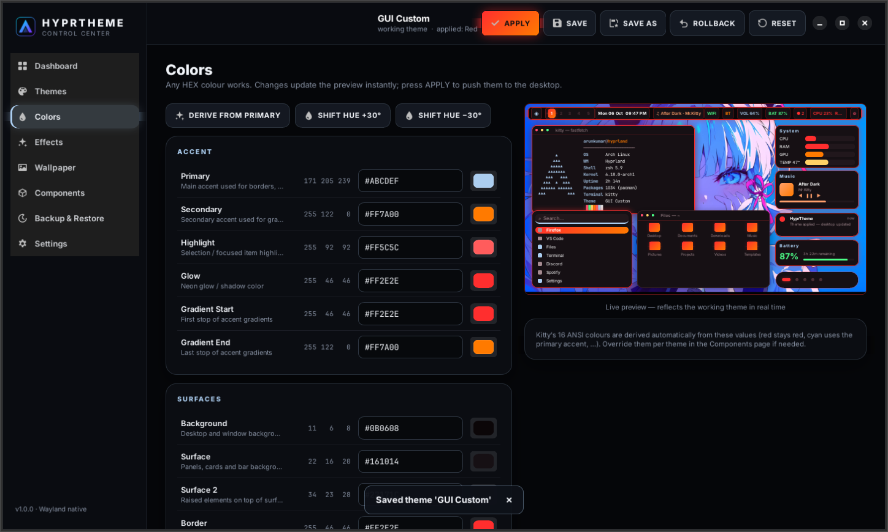

<div align="center">


# HyprTheme

**Hyprland Theme Control Center** — one theme, your whole desktop.

Pick a preset, tweak any colour or effect, watch the live preview, press **APPLY**, and Hyprland, Waybar, Kitty, Rofi, SwayNC, Hyprlock, Wlogout and your wallpaper change together.

[](https://github.com/arunkumartm68/Hyprland-Dot_files/actions/workflows/ci.yml)


[](LICENSE)



</div>

---

## About this project

This started as my personal **Hyprland** setup. I'm not a big fan of the excessive transparency found in many Hyprland themes, so I built my own rice with the help of Claude. It then grew into **HyprTheme**: the original configuration is still here under `config/` as the reference base, and everything above it is a real theming application so that any Arch Linux + Hyprland user can install it, pick a preset, tune every colour and effect, and switch the whole desktop from one place.

I use Hyprland as my daily driver, so the defaults are tuned to be comfortable, functional and visually balanced rather than flashy. If you have suggestions or better ideas, open an issue or adapt it to your liking.

## What is HyprTheme?

HyprTheme is a desktop theming application for [Hyprland](https://hypr.land). Instead of editing `hyprland.conf`, Waybar CSS, `kitty.conf`, a rofi `.rasi`, SwayNC CSS, `hyprlock.conf` and Wlogout CSS by hand, you edit **one theme** (colours, effects, wallpaper, component options) in a GUI or on the command line. HyprTheme renders every component's configuration from it, backs up what it replaces, writes the files, and reloads the running programs.

```
Open HyprTheme → choose CYAN → preview → APPLY → the desktop is cyan
             → choose RED  → APPLY             → the desktop is red
             → pick any colours, drag the sliders → SAVE AS "My Theme" → APPLY
```

The GUI and the `hyprtheme` CLI share the same engine, so everything is scriptable.

## Features

- **17 presets** — Cyan, Red, Green, Orange, Ice Blue, Pink, White, Yellow, RGB (rotating rainbow border), AMOLED, Cyberpunk, Matrix, Iron Man, Spider-Man, Ocean, Sunset, Ben 10. Each is a real theme file, not a screenshot.
- **Colour editor** — 23 semantic colours (primary, secondary, highlight, background, surfaces, text, border, glow, gradient, states, battery/system/media, workspaces, window borders), each with a colour picker, HEX field, RGB readout and swatch. Any HEX colour works.
- **Effects** — transparency, blur, border width, corner radius, glow intensity, animation speed, window/outer/inner gaps; toggles for glass, neon glow, animations, gradient, shadows and rainbow border.
- **Live preview** — a realistic desktop mock-up (bar, terminal, launcher, notification, system/music/battery widgets, file manager, workspaces) styled from the actual theme values. Every change is reflected instantly.
- **Wallpaper** — library grid with thumbnails, file picker, transition style, duration and fit mode; swww preferred, hyprpaper as fallback; restored at login without a background service.
- **Components** — detection (✓ installed / ⚠ not installed / ✕ error) and per-component options (Waybar layout, Kitty font, Rofi size, Hyprlock widgets, …). Missing components are skipped, never fatal.
- **Backup & restore** — automatic snapshot before every apply, a pristine copy of your original configs, manual snapshots, one-click rollback, restore original.
- **Import / export** — portable `.hyprtheme` files that contain colours, effects, component settings, wallpaper reference and metadata. No personal files are packaged (embedding the wallpaper is opt-in).
- **Safe by design** — XDG paths only, no hard-coded user names, GPUs, monitors or wallpapers. Your `hyprland.conf` is never rewritten: a single marked `source =` line is added. Nothing is deleted without a backup.
- **Hyprland version aware** — generates legacy hyprlang rules (< 0.53), the newer `match:` rules (0.53+) and a Lua module for the Lua config, picked automatically.

## Screenshots

| Themes | Colors |
| --- | --- |
|  |  |

| Effects | Wallpaper |
| --- | --- |
|  |  |

| Components | Backup & Restore |
| --- | --- |
|  |  |

<details>
<summary>Settings and a custom theme</summary>




</details>

The screenshots are rendered by the headless GUI test (`tests/test_gui.py`), so they always match the code.

## Architecture

```
GUI (GTK4 / libadwaita) ──┐                     ┌─ templates/hyprland  → ~/.config/hypr/hyprtheme.conf (+ .lua)
                          ▼                     ├─ templates/waybar    → style.css, config.jsonc, hyprtheme-colors.css
CLI (hyprtheme …) ──▶ ThemeEngine ──▶ Theme ──▶ Generator ──┼─ templates/kitty     → hyprtheme.conf (included from kitty.conf)
                          │                     ├─ templates/rofi      → hyprtheme.rasi (@theme in config.rasi)
                          ├─ BackupManager      ├─ templates/swaync    → style.css, config.json
                          ├─ WallpaperManager   ├─ templates/hyprlock  → hyprlock.conf, hyprlock-hyprtheme.conf
                          └─ ReloadManager      ├─ templates/wlogout   → style.css, layout, themed icons
                                                └─ templates/wallpaper → hyprpaper.conf / swww
```

```
hyprtheme/
├── core/        theme engine (no GTK): paths, colors, theme, templating, generator,
│                backup, portable, components, reload, wallpaper, settings, engine
├── app/         GTK4/libadwaita control center: pages, widgets, live preview
└── cli.py       command-line interface
themes/presets/  built-in presets        templates/   per-component templates
assets/icons/    UI + app icons          tests/       pytest suite (core + headless GUI)
docs/            format, architecture, CLI, troubleshooting
config/          the original dotfiles this project grew out of (reference)
install.sh · uninstall.sh · data/hyprtheme.desktop
```

Details: [docs/ARCHITECTURE.md](docs/ARCHITECTURE.md).

## Installation

**Requirements:** Arch Linux (or derivative) with Hyprland, Python ≥ 3.11, `python-gobject`, `gtk4`, `libadwaita`. The CLI works with Python alone.

```bash
git clone https://github.com/arunkumartm68/Hyprland-Dot_files.git
cd Hyprland-Dot_files
./install.sh                    # user install into ~/.local (no root)
./install.sh --with-optional    # also install waybar, kitty, rofi-wayland, swaync, hyprlock, wlogout, swww, fonts
./install.sh --apply cyan       # install and apply a preset right away
./install.sh --system           # install under /usr/local instead
```

The installer detects Arch and Hyprland, checks dependencies (installs missing required packages with `pacman`), copies the application to `$XDG_DATA_HOME/hyprtheme`, installs the `hyprtheme` command and a **HyprTheme** desktop entry, and creates `~/.config/hyprtheme/{themes,wallpapers}`. Nothing in `~/.config` is modified until you apply a theme, and every apply makes a backup first.

Optional packages HyprTheme can theme: `waybar kitty rofi-wayland swaync hyprlock wlogout swww` (or `hyprpaper`), plus `ttf-jetbrains-mono-nerd inter-font papirus-icon-theme` for the default fonts and icons.

Remove with `./uninstall.sh` (`--restore` puts your original configs back, `--purge` also deletes your themes and backups).

## Usage

1. Launch **HyprTheme** from the application menu (or `hyprtheme gui`).
2. **Themes** → click a preset. It loads into the editor and the preview updates.
3. **Colors** / **Effects** / **Wallpaper** / **Components** → change anything; the preview follows.
4. **APPLY** → configs are generated, backed up, written and reloaded. The desktop changes.
5. **SAVE AS** → keep your variant in `~/.config/hyprtheme/themes/`. **ROLLBACK** → undo the last apply. **RESET** → discard edits, apply the default theme, or restore the original configuration.

Shortcuts: `Ctrl+Enter` apply, `Ctrl+S` save, `Ctrl+Shift+S` save as, `Ctrl+Z` rollback, `Alt+1…8` pages.

### Persistence

Themes survive reboots because the generated files do: Hyprland sources `~/.config/hypr/hyprtheme.conf`, the other programs read their generated configs on start, and the wallpaper is restored by one `exec-once = hyprtheme wallpaper restore` line in that file. No daemon or service is installed.

## Theme creation

- In the GUI: start from any preset, edit, **SAVE AS**.
- On the command line:

  ```bash
  hyprtheme new "My Theme" --base pink --set primary=#ABCDEF --set blur=20 --set glass=false --apply
  ```

- By hand: drop a `theme.json` into `~/.config/hyprtheme/themes/`. A minimal theme is `{ "name": "Mint", "colors": { "primary": "#3DFFB0" } }`; everything else is filled with defaults. See [docs/THEME_FORMAT.md](docs/THEME_FORMAT.md).

Kitty's 16 ANSI colours are derived from the theme automatically and can be overridden per theme.

## Import / export

```bash
hyprtheme export ~/my-theme.hyprtheme            # current theme
hyprtheme export ~/ocean.hyprtheme --theme ocean --embed-wallpaper
hyprtheme import ~/friend.hyprtheme --name "Friend's rice" --apply
```

A `.hyprtheme` file is JSON with the theme, export metadata and (only on request) the wallpaper image. Wallpaper paths are reduced to file names so nothing personal leaks. The GUI has IMPORT / EXPORT buttons on the Themes page.

## CLI

```
hyprtheme list                    hyprtheme save "My Theme"
hyprtheme current                 hyprtheme rollback
hyprtheme apply cyan              hyprtheme export mytheme.hyprtheme
hyprtheme apply "Iron Man"        hyprtheme import mytheme.hyprtheme
hyprtheme status                  hyprtheme reset [--original]
hyprtheme backup list|create|restore <id>
hyprtheme wallpaper list|set <path>|restore
hyprtheme config integration.waybar variables
```

Full reference: [docs/CLI.md](docs/CLI.md).

## Supported components

| Component | What is themed | How it is hooked in |
| --- | --- | --- |
| **Hyprland** | active/inactive borders (gradient), opacity, blur, rounding, gaps, shadows, animations, layer blur for shells, `$ht_*` variables | one `source = ~/.config/hypr/hyprtheme.conf` line (or `require("hyprtheme")` for Lua configs) |
| **Waybar** | launcher, workspaces · clock, music · network, Bluetooth, volume, battery, notifications, CPU/RAM/temp, tray, power | `style.css` + `config.jsonc` (managed) or `hyprtheme-colors.css` (variables) |
| **Kitty** | background, foreground, cursor, selection, URL, tabs, marks, opacity, padding, 16 ANSI colours | `include hyprtheme.conf` in `kitty.conf` |
| **Rofi** | centered glass launcher, icons, selected-item gradient, keyboard navigation | `@theme` line in `config.rasi` |
| **SwayNC** | notification cards, control center, buttons, toggles, sliders, progress bars, MPRIS widget | `style.css` (+ `config.json`) |
| **Hyprlock** | wallpaper background, glass card, clock, date, user, password field, battery, layout, now-playing | `hyprlock.conf` (+ `$ht_*` variables file) |
| **Wlogout** | Lock, Logout, Sleep, Restart, Shutdown buttons with themed SVG icons | `style.css` + `layout` |
| **Wallpaper** | image, transition, duration, fit | swww (preferred) or hyprpaper |

Each component can be set to *managed*, *variables only* or *off* in Settings.

## Troubleshooting

See [docs/TROUBLESHOOTING.md](docs/TROUBLESHOOTING.md). The most common fixes:

- GUI will not start → `sudo pacman -S --needed python-gobject gtk4 libadwaita`.
- Hyprland config error → set the rule syntax in Settings (`modern` for 0.53+, `legacy` for older, `lua`).
- Wallpaper not set → install `swww` or `hyprpaper`; remove competing `exec-once` wallpaper lines.
- Want everything back → `hyprtheme rollback` or `hyprtheme reset --original`.

## Using only the dotfiles

If you just want the reference rice without the application, the original configuration lives in `config/`:

| Directory | Component |
| --- | --- |
| `config/hypr` | Hyprland, Hyprlock, Hyprpaper |
| `config/waybar` | Waybar bar and style |
| `config/kitty` | Kitty terminal |
| `config/rofi`, `config/wofi` | Launchers |
| `config/swaync`, `config/mako` | Notifications |
| `config/fish`, `config/fastfetch`, `config/neofetch`, `config/cava` | Shell and terminal extras |

```bash
sudo pacman -S hyprland waybar kitty rofi-wayland dolphin fish fastfetch
yay -S swaync hyprlock hyprpaper
git clone https://github.com/arunkumartm68/Hyprland-Dot_files.git
cd Hyprland-Dot_files
cp -r config/* ~/.config/          # back up your own ~/.config first
```

Then log in to Hyprland from your session manager (sddm, greetd, ly). Those files contain a few machine-specific lines (monitor, keyboard layout, screenshot folder) that you will want to adjust; HyprTheme itself never hard-codes any of them.

## Development

```bash
python -m hyprtheme list                  # run from the checkout, no install
python -m hyprtheme gui
pytest                                    # core, generator, engine, CLI
xvfb-run pytest tests/test_gui.py         # drives the real GTK app headlessly
ruff check hyprtheme tests && mypy
```

Tests run inside a temporary `$HOME` and never touch your configuration. See [CONTRIBUTING.md](CONTRIBUTING.md) and [CHANGELOG.md](CHANGELOG.md).

## License

[MIT](LICENSE). The reference dotfiles under `config/` and the sample wallpapers under `Background/` are the original author's personal files.
